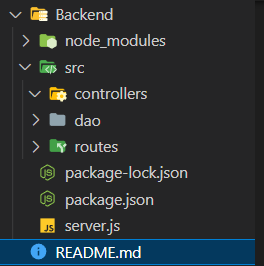

Criação do Backend
- entrar na pasta nome do projeto
Instalar as dependências

```shell
npm i express
```

<p style='font-size:13px; margin-left: 6px'><b>npm i express</b> ele facilita a criação de um servidor, O "express" é um framework web popular para Node.js que simplifica o desenvolvimento de aplicativos web e APIs.</p>

```shell
npm i cors
```

<p style='font-size:13px; margin-left: 6px'><b>npm i cors</b> informam aos navegadores para permitir que uma aplicação Web seja executada em uma origem e acesse recursos de outra origem diferente.</p>

```shell
npm i mysql
```

<p style='font-size:13px; margin-left: 6px'>O comando npm i mysql ou npm install mysql é usado para instalar o pacote "mysql" no seu projeto Node.js. O pacote "mysql" é uma biblioteca que permite interagir com bancos de dados MySQL a partir de aplicativos Node.js.
</p>
<p style='font-size:13px; margin-left: 6px;'>Ao instalar o pacote "mysql", você pode usar as funções e métodos fornecidos pela biblioteca para estabelecer conexões com bancos de dados MySQL, executar consultas SQL, inserir, atualizar e excluir dados, entre outras operações relacionadas ao banco de dados..</p>

Em seguida fazemos a criacão do <b>server.js</b>

```javascript
const express = require('express')
const cors = require('cors')

const router = require('./src/routes/routes.js')

const app = express()
app.use(express.json())
app.use(cors())
app.use('/',router)

app.listen(3000,() => {
    console.log("Servidor rodando na porta 3000")
})
```

O arquivo <b>server.js</b> deve estar dentro do backend e após fazer essa verificação executar o comando:
```shell
npm init
```

Logo em seguida devemos fazer a estrutura de pasta começando
<br>


<p style='font-size:13px; margin-left: 6px;'><b>src</b> A pasta "src" (source) em um projeto de backend geralmente é usada para armazenar o código-fonte do aplicativo. Ela contém os arquivos JavaScript, TypeScript, ou qualquer outra linguagem de programação que você esteja usando para desenvolver a lógica do servidor.

<p style='font-size:13px; margin-left: 6px;'>A organização do código em uma pasta "src" é uma prática comum para manter o projeto organizado, facilitar a manutenção e separar claramente o código-fonte do restante dos arquivos, como configurações, arquivos de teste e outros recursos.</p>

<p style='font-size:13px; margin-left: 6px;'><b>Rotas:</b> Aqui você pode definir os pontos de extremidade da API, especificando como as solicitações HTTP devem ser tratadas e como as respostas devem ser retornadas. Cada rota pode ser definida em um arquivo separado para melhor organização.

<p style='font-size:13px; margin-left: 6px;'><b>Controladores:</b> Os controladores são responsáveis por conter a lógica de negócios da aplicação. Eles recebem os dados da requisição, realizam ações apropriadas no banco de dados ou outros serviços e retornam a resposta ao cliente.


<p style='font-size:13px; margin-left: 6px;'><b>Dao: </b> é frequentemente usada para separar e abstrair a lógica de acesso a dados (operações de banco de dados) do restante da lógica de negócios da aplicação. Ela é uma parte do padrão de design DAO, que tem como objetivo isolar as operações de banco de dados do restante do código para tornar o sistema mais modular, organizado e fácil de manter.

<p style='font-size:13px; margin-left: 6px;'><b>Models:</b> Ele conversa diretamente com o banco de dados. Eles são frequentemente usados para interagir com o banco de dados, realizando operações como inserção, consulta, atualização e exclusão.</p>

Criando um CRUD

<p style='font-size:13px; margin-left: 5px'>O que é CRUD?</p>
<p style='font-size:13px; margin-left: 10px;'><b>Create</b> (Criar): Essa operação envolve a criação de novos registros ou entradas no banco de dados. Por exemplo, ao preencher um formulário de registro em um site, você está criando um novo registro de usuário.</p>

- Exemplo:

```javascript
const create = (req, res)=>{
    const {id, nome, descricao, valor} = req.body
    let string = `INSERT INTO item VALUE('${id}','${nome}','${descricao}',${valor})`
    con.query(string,(err, result)=>{
        if(err == null)
            res.status(201).end()
        else
            res.status(500).json(err).end()
    })
}
```

<p style='font-size:13px; margin-left: 10px;'><b>Read</b> (Ler): Essa operação envolve a leitura ou recuperação de informações existentes do banco de dados. Isso pode incluir pesquisas ou visualizações de registros específicos. Por exemplo, ao fazer login em um site, você está lendo informações sobre sua conta para verificar sua identidade.

```javascript
const read = (req, res)=>{
    let string = "SELECT * FROM item"
    con.query(string, (err, result)=>{
        if(err == null)
            res.json(result).end()
    })
}
```

<p style='font-size:13px; margin-left: 10px;'><b>Update</b> (Atualizar): Essa operação envolve a modificação de registros existentes no banco de dados. Isso pode incluir a alteração de informações como nome, endereço, etc. Por exemplo, ao editar seu perfil em uma rede social, você está realizando uma operação de atualização.

```javascript
const update = (req,res) => {
    const {nome_cel,valor,id} = req.body
    let string = ` UPDATE produtos SET nome_cel = '${nome_cel}', valor = '${valor}' WHERE id = ${id}` 
    con.query(string, (err, result) => {
        if (err == null) {
            if (result.affectedRows > 0) {
                res.json(result).end()
                return
            }
            res.send("não encontrado")
            return
        }
        res.json(err).end()
    })
}
```

<p style='font-size:13px; margin-left: 10px;'><b>Delete</b> (Excluir): Essa operação envolve a remoção de registros do banco de dados. Por exemplo, ao excluir uma postagem em um fórum online, você está executando a operação de exclusão.

```javascript
const delete = (req, res)=>{
    let string = `DELETE FROM item WHERE id = '${req.params.id}'`
    con.query(string, (err, result)=>{
        if(result.affectedRows > 0)
            res.status(204).end()
        else
            res.status(404).end()
    })
}
```
